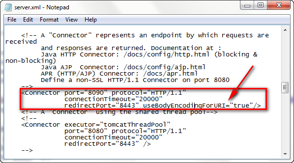

***

### 简介

- 在很多动态网页中，绝大部分内容都是固定的，只有局部需要动态产生和改变
- 如果动态网页中固定的部分也交给编写Servlet的程序来负责，整个Servlet程序将会变得很臃肿，不便于维护
- JSP简化了Servlet的编写，在jsp文件中，Java代码和html代码混合在一个编写
- 静态的内容由html负责，而动态的内容使用Java代码编写
- Java服务端网页，即在HTML页面中编写Java代码的页面
- JSP可以放置在WEB应用程序中的除了WEB-INF及其子目录外的其他任何目录当中

***

### JSP的运行原理

- WEB容器（Servlet引擎）接收到以.jsp为拓展名的的URL的访问请求时，它将把该访问的请求交给jsp引擎进行处理
- 每个jsp页面在第一次被访问的时候，jsp引擎将它翻译为一个Servlet源程序，接着再把这个Servlet源程序编译成一个class文件，然后再由WEB容器
像调用普通的servlet程序那样装载和解释执行这个由jsp程序产生的Servlet程序
- jsp规范中也没有规定jsp中的脚本程序必须使用Java程序来编写，jsp中的脚本程序代码可以采用Java语言之外的其他脚本语言进行编写，但是jsp文件最后一定要生成Servlet程序进行执行
- 可以在WEB程序正式发布之前，将其中所有的jsp页面先编译成servlet程序
- 使用eclipse开发时，由jsp生成的Java类所放置的位置为：  
  - （workspace）：.metadata\.plugins\org.eclipse.wst.server.core\tmp2\work\Catalina\localhost\iim_proj\\org\apache\jsp\

***

### JSP中的九个隐藏对象
1. request对象：HttpServletRequest类的对象
2. response对象：HttpServletResponse类的对象
3. pageContext对象：PageContext类的对象，可以获取其他八个隐藏对象
4. session对象：代表的是浏览器和服务器之间的一次会话
5. application对象：ServletContext类的对象，代表是整个WEB应用
6. config对象：当前jsp对应的servlet的ServletConfig类的对象
7. out对象：JspWriter类对象，可以直接将内容输出到浏览器上
8. page对象：代表的是当前jsp生成的对应的servlet对象本身，为Object类型，只可以调用Object类中的方法
9. exception对象：只有特殊的情况下才可以使用（当前jsp文件中声明了<%@ page isErrorPage="true" %>）

***

### 编写JSP

- html代码的编写与编写普通的html文件没有区别
- java代码写在<% %>之间

***

### JSP指令
- 概述：jsp指令是为了jsp引擎而设计的，它们并不直接产生任何可见的输出，而只是告诉引擎如何处理jsp页面的其余部分
- 格式:
  - ` <%@ 指令 属性值="值" %> `
  - 注意：属性名部分是大小写敏感的,jsp 2.0中定义了page、include、taglib三种指令
- 如果要在一个jsp页面中设置同一条指令的多个属性，可以使用多条指令语句单独设置每个属性，也可以使用同一条语句设置该指令的多个属性
  - 例如:  
    - 第一种方式：  
    ```
      <%@ page contentType="text/html;charset=gb2312"%>
      <%@ page import="java.util.Date" %>
    ```
    - 第二种方式：
     ``` 
      <%@ page contentType="text/html;charset=gb2312" import="java.util.Date" %>
    ```
#### page指令
- 用于定义jsp页面的各种属性
- 可以防止在jsp页面中的任何地方，一般建议放置在页面的开头
- 不管page指令放置在页面的任何地方，其作用的范围都是整个jsp页面
- 支持的属性与属性值 
  - language="java" 指定当前jsp支持编写的语言，实际上并没有什么作用，java是唯一的值
  - extends="package.class" jsp翻译后的类继承的类，几乎没有什么作用
  - import="package.class | package.* ..." 导入的java类
  - session="true|false" 指定当前的页面中是否可以使用隐藏对象session，仅当true的时候可以使用session隐藏对象，也就是使用当前页面是否一定要产生HttpSession对象
  - errorPage="relative_utl" 指定要是当前页面出错的时候要跳转到的页面
  - isErrorPage="true|fasle" 表示当前页面是否是出错处理页面，当为true的时候可以使用exception对象，不建议直接使用，因此可以将其放置在WEB-INF文件夹中，WEB-INFO文件中的文件不可以直接通过URL地址访问，但是可以通过请求转发的机制实现访问
  - contentType="mineTyep[;charset=characterSet] | text/html;charset="utf-8" 当前jsp页面响应给用户的类型（可以是html可以是微软的word），编译成java类的时候，实际上是调用了response.setContentType("text//html; charset=UTF-8");其中charset表示的是响应页面所使用的的编码
  - pageEncoding="characterSet|ISO8859-1" 指定当前jsp页面所使用的的编码的格式，通常与contentType中的charset的取值相同
  - isELIgnored="true|false" 表示是当前页面是否可以使用EL表达式，通常取值为false

#### include指令
- 通知jsp引擎在翻译当前jsp页面时将其他文件中的内容合并进当前jsp页面转换的Servlet中，属于静态导入
- file属性值必须是相对路径

***

### JSP标签
- jsp中提供一种叫做action的元素，在jsp页面中使用action元素可以完成各种通用的jsp页面功能
- action元素采用XML元素的语法格式，即每个action元素在jsp页面中都以XML标签的形式出现
- jsp规范中定义了一些标准的action元素，这些元素的标签名都是以jsp为前缀，并且全部采用小写，例如，<jsp:include>,<jsp:forward>等等 
- <jsp:include>标签
  - 用于把另外一个资源的输出内容插入进当前的jsp页面的输出内容当中，是一种动态引入的方法
  - 使用这种方式跟前面的include指令的最大区别是：include指令生成的是一个servlet类，而jsp标签方式生成的有两个servlet类
- <jsp:forward>标签
  - 请求转发，跟使用request的getRequestDispatcher(String path)的方式差不多
  - 它们之间有一个区别就是，使用jsp标签可以使用<jsp:param>子标签向目标页面传递参数值，在目标页面中可以使用getParameter(String paramName）方法获取参数值
  - 以下的代码是等价的  
    ```<jsp:forward page="/b.jsp"></jsp:forward> ```  
    ```<% request.getRequestDispatcher("/b.jsp").forward(request, response); %>```
    
***
## 中文乱码问题
- 要在当前的jsp页面中出现中文，且发给用户的响应页面可以正常显示中文，应该满足以下的条件
  - 出现page指令中的charset指定的编码与pageEncoding指定的编码一致，且是支持中文显示的编码，一般推荐使用UTF-8
  - 浏览器中查看页面的编码与page指令中指定的编码一致
  - page指令：
  ``` <%@ page language="java" contentType="text/html; charset=UTF-8" pageEncoding="UTF-8"%> ```
  - 如果使用eclipse开发，一般默认page中的编码为ISO-8859-1,可以通过以下的方法使得新建的jsp页面中的page指令的编码都是UTF-8,首先找到Window，在点击Preference，进行以下图片所显示的操作
    
- 若要获取的参数中包含中文，采用以下的方法
  - 若请求使用了post方法：在reques.getParameter(String name)方法之前调用request.setCharacterEncoding(String characterEncodingname)方法，要注意的是顺序不能颠倒，代码如下所示：
  ```
    <% request.setCharacterEncoding("UTF-8"); %>
	  <%= request.getParameter("username") %>
  ```
  - 若请求使用的是get方法，若直接使用上面的方法还是会出现乱码，此时有两种方法来解决问题，推荐使用第二种
    - 第一种：使用String的构造方法
    ``` 
      public String(byte[] bytes,
      String charsetName)
       throws UnsupportedEncodingException
    ```
    例如：
    ``` 
      <%= new String(request.getParameter("username").getBytes("ISO-8859-1"), "UTF-8") %>
    ```
    - 第二种：通过设置tomcat服务器
      - 具体步骤：
        1. 找到tomcat的配置文件：server.xml（\apache-tomcat-6.0.51\conf\server.xml）
        2. 在该配置文件中找到`<Connector port="8090" protocol="HTTP/1.1" connectionTimeout="20000" redirectPort="8443" />`，注意不要找错，在后面添加useBodyEncodingForURI="true"，配置的结果如下图所示：  
      
        3. 如果使用的是eclipse，需对Project Explorer中的Server项目（这是对tomcat服务器的一个映射）中的配置文件server.xml文件进行跟上面一样的修改，然后重新启动
        4. 接下来获取参数的步骤跟处理post请求时一样的，代码如下:
        ```
           <% request.setCharacterEncoding("UTF-8"); %>
	         <%= request.getParameter("username") %>
        ```

***

### 请求与重定向

- 本质区别：请求的转发只发出了一次请求，而重定向则发出了两次请求
- 具体：  
  - 对于请求的转发，地址栏是初次发出请求的地址；对于请求的重定向：地址栏不在是初次发出的请求地址，地址栏为最后响应的地址
  - 对于请求的转发，在最终的Servlet中，request对象和中转的那个request对象是同一个对象；而对于重定向，在最终的servlet中，request对象和中转的那个request不是同一对象
  - 对于请求转发，只能转发给当前web应用的资源；而对于请求重定向，可以重定向到任何资源
  - 对于请求转发，/代表的是当前web应用的根目录；而对于重定向，/代表的是当前web站点的根目录
  
- 实现请求转发的代码实现  
``` java
//1.调用HttpServletRequest的getRequestDispatcher()方法获得RequestDispacher对象
//调用getRequestDispatcher()传入需要转发的地址
String path = "/testServlet";
RequestDispather requestDispatcher = request.getDispacher(path);
//2.调用HttpServletRequest的forward(request, response)进行请求的转发
requestDispatcher.forward(request, response);
```
- 实现重定向的代码
``` java
//直接调用response.sendDirect(path);
String path = "http://www.baidu.com";
response.sendDirect(path);
```
***
