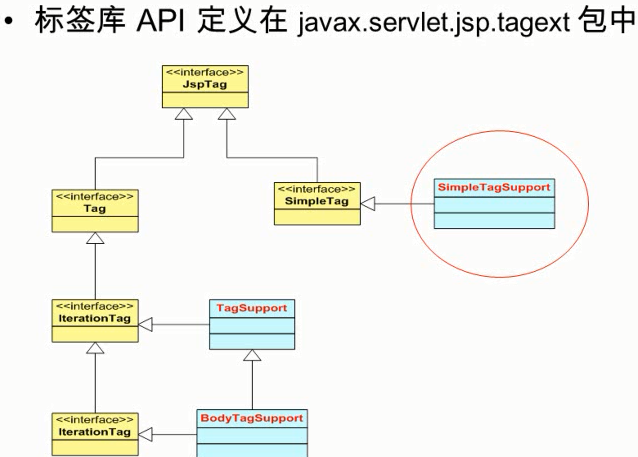
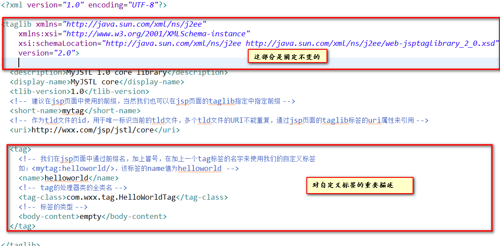
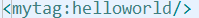

- 什么是自定义标签
	- 用户定义的一种自定义的jsp标记，当一个含有自定义标签的jsp页面被jsp引擎编译成servlet时，tag标签被转化成了对一个被称为**标签处理类**的对象操作。于是当jsp页面被jsp引擎转化为servlet时后，实际上tag标签被转化为了对tag类的操作
	- 标签库API  
	  
	- 传统标签与简单标签
		- 开发自定义标签，**其核心就是要编写处理器类**，一个标签对应一个标签处理器类，而一个标签库则是很多标签处理器类的集合。所有的标签处理器类都要实现JspTag接口，该接口中没有定义任何的方法，重要作为Tag和SimpleTag接口的父接口
		- 在JSP2.0以前，所有标签处理器类必须实现Tag接口，这样的标签叫做传统标签
		- JSP2.0规范中又定义了一种新的类型的标签，称为简单标签，其对应的处理器类要实现SimpleTag接口
	- 自定义标签的开发与应用步骤
		- 编写完成标签功能的Java类（标签处理器类）：实现SimpleTag接口
		- 表写标签库中的描述（tld）文件，在tld文件中对自定义标签进行描述，如下是对自定义标签类的描述：    
		  
		- 在JSP页面中导入和使用自定义标签
			- 使用taglib指令导入标签库    
			  
			- 使用自定义标签  
			        