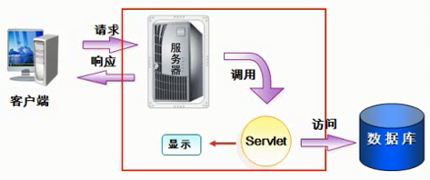
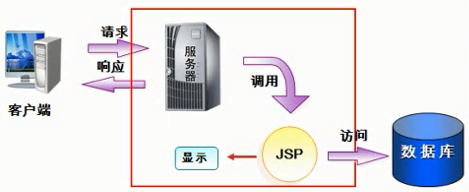
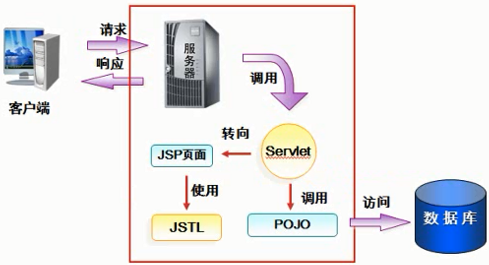

# Spring MVC设计模式

## 一、简介

### 1、MVC各自的含义 
- M代表的是模型
  - 是与数据库相关的操作（业务数据和业务逻辑）
  - 使用POJO操作数据库
- V代表的视图
  - 视图指的是向用户显示的相关的数据
  - 接收用户的输入
  - 不进行任何实际的业务处理
  - 使用JSP
- C代表是控制，经常使用Servlet
  - 接收用户的输入并调用模型和视图去完成用户的需求
  - 接收请求并决定调用哪个模型组件去处理请求，然后决定调用哪个视图来显示模型处理返回的数据
  - 使用Servlet

### 2、三种不同的JavaEE开发流程及其缺点
- 第一种方式： 

  - 缺点：Servlet不擅长显示，在servlet中编写的数据库代码不利于重复利用
- 第二种方式：

  - 缺点：虽然JSP适合用来显示，但将访问数据库的Java代码写在JSP页面，不利于JSP的维护，与第一种方式相同，访问数据库的Java代码维护也很困难，不利于重用
- 第三种方式（MVC）：

